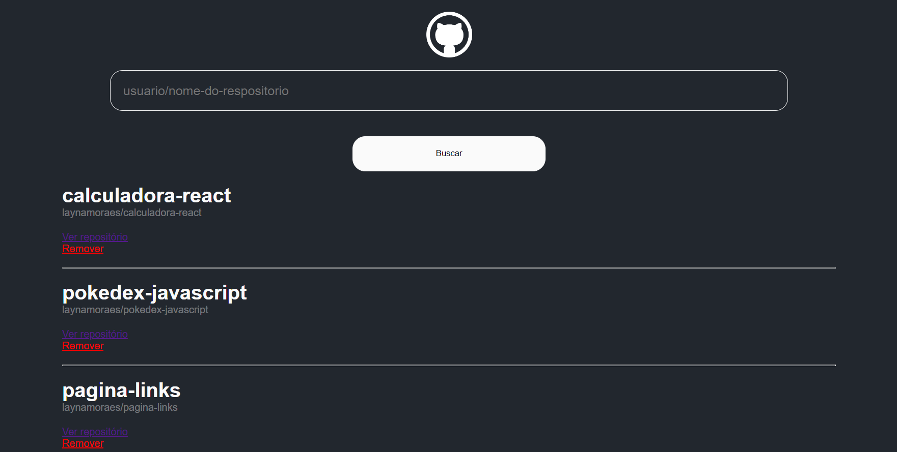

# Wiki de Repositórios do GitHub

## 📜 Sobre

Uma página de buscar de repositórios do GitHub utilizando React e os conceitos aprendidos no Bootcamp Orange Tech + da DIO.
  

## 🛠 Tecnologias utilizadas

- [React.js](https://pt-br.reactjs.org/)
- [CSS](https://developer.mozilla.org/pt-BR/docs/Web/CSS)
- [JavaScript](https://developer.mozilla.org/pt-BR/docs/Web/JavaScript)
- [Axios](https://axios-http.com/ptbr/docs/intro)
- [GitHub Api](https://docs.github.com/en/rest?apiVersion=2022-11-28)
- [Git](https://git-scm.com/)
  

## ▶ Rodar o projeto

- Primeiro passo, clone o projeto em sua maquina
- Abra a pasta do projeto no terminal
- Instale as dependências com o comando `npm i` 
- Inicie o servidor com o comando `npm start` , uma nova aba ira se abrir no navegador, caso não ocorra
- Abre uma aba no navegar e navegue para localhost:3000
  

## ⌨ Resultado

 

